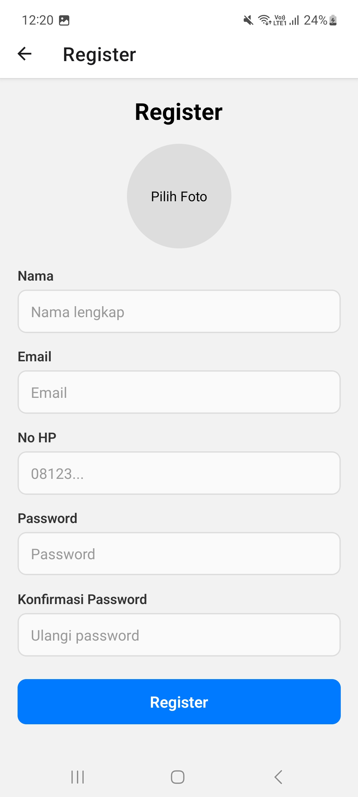
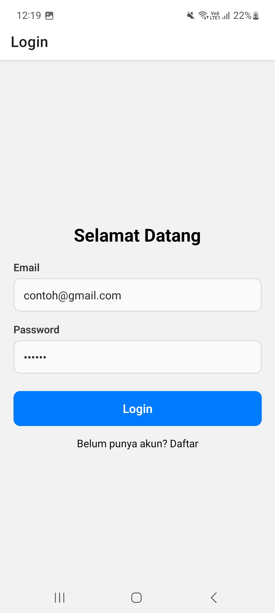
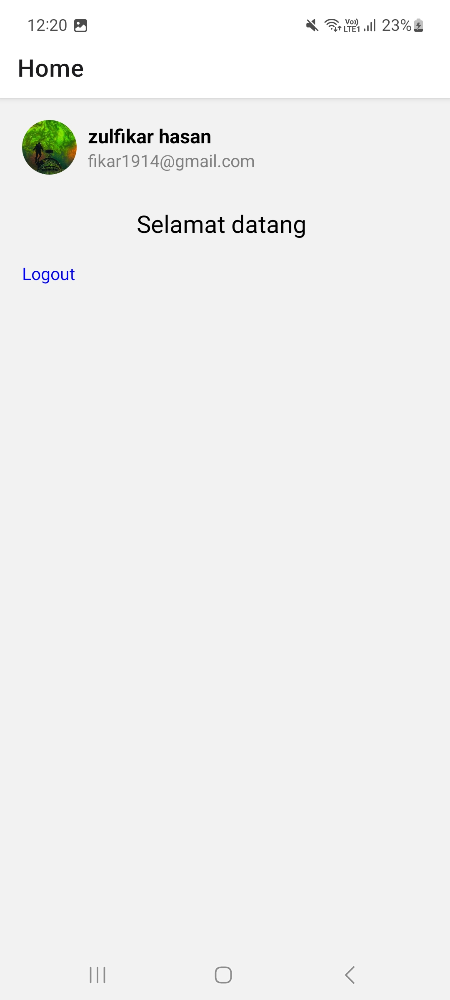

## Berita App

- **Nama** : Zulfikar Hasan  
- **NIM** : 2410501016  

---

Project ini adalah aplikasi Form sederhana yang mengimplementasikan fitur autentikasi pengguna berupa login dan regist
Aplikasi ini bisa membuat user mengupload foto nya sendiri ketika regist dan akan diarahkan ke Home setelah login selesai

---

## Fitur Utama

* Formik
  Digunakan untuk mengelola state form seperti input value, error, dan status submit agar lebih terstruktur dan mudah dikontrol.
* Yup
  Digunakan sebagai schema validation untuk memastikan input user valid (misalnya format email, panjang password, dan konfirmasi password).
* Expo Image Picker
  Digunakan untuk memilih foto profil dari galeri perangkat.
* AsyncStorage
  Digunakan untuk menyimpan data user secara lokal agar tetap tersedia meskipun aplikasi ditutup (tanpa database).

---

## Bonus Level 3
* Data Persistence dengan AsyncStorage
* Validasi Login terhadap Data Register
* Autentikasi Sederhana Tanpa Database


---

## Screenshot Preview

<p>
  
  
  
</p>

---
## Cara Menjalankan

Aplikasi ini menggunakan **Expo**.

### 1. Clone Repository
```bash
git clone <URL_REPOSITORY>
```

### 2. Install Expo
```bash
npm install expo
```

### 3. Jalankan Aplikasi
```bash
npx expo start
```
